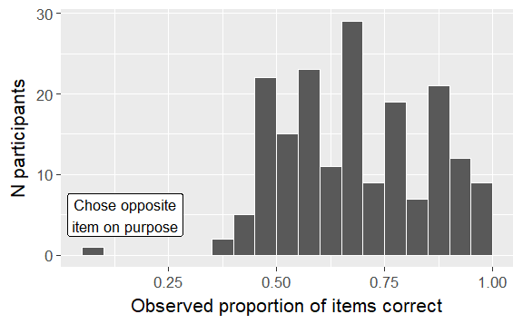
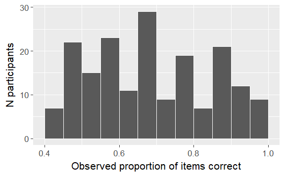

Download data from the database
================
Tristan Mahr
2018-03-13

This script downloads response-level data from the minimal pairs experiment from timepoint 1 of the longitudinal study.

The data-set includes only trials from the most frequently used item-pairs. (There was some variation in the item counts and item sets in the initial versions of the task, so we elect to keep the most frequent items.) We exclude a participant with too few items from their administration of the experiment. (Perhaps a crashed or aborted experiment.) We exclude a participant who apparently chose the wrong item on every trial. We also include EVT-2, PPVT-4 and GFTA-2 as these are useful covariates.

Connect and download the scores
-------------------------------

Connect to UMN database using the L2TDatabase package. <https://github.com/LearningToTalk/L2TDatabase>

``` r
# Download test scores from the database
library(L2TDatabase)
library(dplyr)
#> 
#> Attaching package: 'dplyr'
#> The following objects are masked from 'package:stats':
#> 
#>     filter, lag
#> The following objects are masked from 'package:base':
#> 
#>     intersect, setdiff, setequal, union
library(ggplot2)

# Connect to database. This assumes the L2T Database configuration file 
# is the user's home folder.
db_config_file <- path.expand("~/l2t_db.cnf")
l2t <- l2t_connect(db_config_file, "backend")

# Get the timepoint 1 minimal pair responses and vocabulary scores. (I'm
# using the backend database because I wrote the first version of this
# script using it.)
min_pair_raw <- tbl(l2t, "MinPair_Admin") %>%
  left_join(tbl(l2t, "MinPair_Responses")) %>%
  left_join(tbl(l2t, "ChildStudy")) %>%
  left_join(tbl(l2t, "Child")) %>%
  left_join(tbl(l2t, "Study")) %>%
  left_join(tbl(l2t, "EVT")) %>% 
  left_join(tbl(l2t, "PPVT")) %>% 
  left_join(tbl(l2t, "GFTA")) %>% 
  # No practice trials
  filter(Study == "TimePoint1", Running == "Test") %>%
  select(
    Study, ResearchID = ShortResearchID, Female:CImplant,
    MinPair_Age, MinPair_Dialect:Correct,
    PPVT_Age, PPVT_Raw:PPVT_GSV,
    EVT_Age, EVT_Raw:EVT_GSV,
    GFTA_Age, GFTA_RawCorrect:GFTA_Standard) %>%
  select(
    -MinPair_Completion, -MinPair_Notes, 
    -MinPair_Admin_Timestamp, -ResponseID) %>% 
  collect(n = Inf)
#> Joining, by = "MinPairID"
#> Joining, by = "ChildStudyID"
#> Joining, by = "ChildID"
#> Joining, by = "StudyID"
#> Joining, by = "ChildStudyID"
#> Joining, by = "ChildStudyID"
#> Joining, by = "ChildStudyID"

min_pair_raw
#> # A tibble: 6,368 x 30
#>    Study      ResearchID Female   AAE LateTalker CImplant MinPair_Age
#>    <chr>      <chr>       <int> <int>      <int>    <int>       <int>
#>  1 TimePoint1 600L            0     0          0        0          37
#>  2 TimePoint1 600L            0     0          0        0          37
#>  3 TimePoint1 600L            0     0          0        0          37
#>  4 TimePoint1 600L            0     0          0        0          37
#>  5 TimePoint1 600L            0     0          0        0          37
#>  6 TimePoint1 600L            0     0          0        0          37
#>  7 TimePoint1 600L            0     0          0        0          37
#>  8 TimePoint1 600L            0     0          0        0          37
#>  9 TimePoint1 600L            0     0          0        0          37
#> 10 TimePoint1 600L            0     0          0        0          37
#> # ... with 6,358 more rows, and 23 more variables: MinPair_Dialect <chr>,
#> #   MinPair_EprimeFile <chr>, Running <chr>, Trial <int>, Item1 <chr>,
#> #   Item2 <chr>, ImageSide <chr>, CorrectResponse <chr>, Correct <int>,
#> #   PPVT_Age <int>, PPVT_Raw <int>, PPVT_Standard <int>, PPVT_GSV <int>,
#> #   EVT_Age <int>, EVT_Raw <int>, EVT_Standard <int>, EVT_GSV <int>,
#> #   GFTA_Age <int>, GFTA_RawCorrect <int>, GFTA_NumTranscribed <int>,
#> #   GFTA_AdjCorrect <int>, GFTA_AdjNumErrors <int>, GFTA_Standard <int>
```

Screen the data
---------------

``` r
# Function to sort two words, combine with hyphen.
# c("dog", "cat") -> "cat-dog"
make_word_pair <- function(x, y) {
  paste0(sort(c(x, y)), collapse = "-")
}

# Use the word-pair function on each row
min_pair_raw <- min_pair_raw %>%
  mutate(WordPair = purrr::map2_chr(Item1, Item2, make_word_pair))

# Keep only the word-pairs used in every administration. With ~190
# children, these are words with at least 300 responses.
frequent_items <- min_pair_raw %>%
  count(WordPair) %>%
  filter(300 < n) %>%
  print() %>%
  select(WordPair)
#> # A tibble: 15 x 2
#>    WordPair        n
#>    <chr>       <int>
#>  1 bee-key       380
#>  2 big-pig       379
#>  3 car-jar       379
#>  4 cheese-keys   379
#>  5 cold-hold     378
#>  6 goose-juice   379
#>  7 hen-pen       380
#>  8 horse-house   379
#>  9 juice-moose   379
#> 10 keys-peas     379
#> 11 moose-mouse   379
#> 12 mouse-mouth   378
#> 13 sick-sit      379
#> 14 sleep-sweep   380
#> 15 star-store    379

# Who is missing the common items?
too_few_trials <- min_pair_raw %>%
  inner_join(frequent_items) %>%
  count(ResearchID) %>%
  filter(n != 30) %>%
  print()
#> Joining, by = "WordPair"
#> # A tibble: 1 x 2
#>   ResearchID     n
#>   <chr>      <int>
#> 1 660L          16

# Who is that child who responded with the opposite answer?
impossibly_low <- min_pair_raw %>%
  group_by(ResearchID) %>%
  summarise(PropCorrect = mean(Correct)) %>%
  filter(PropCorrect < .15)
pbinom(2, 30, .5)
#> [1] 4.339963e-07

freq_items <- min_pair_raw %>%
  inner_join(frequent_items) %>%
  anti_join(too_few_trials) %>%
  filter(CImplant == 0)
#> Joining, by = "WordPair"
#> Joining, by = "ResearchID"

prop_correct <- freq_items %>%
  group_by(ResearchID) %>%
  summarise(MeanCorrect = mean(Correct), n = n())
```

Make some plots
---------------

``` r
p1 <- ggplot(prop_correct) +
  aes(x = MeanCorrect) +
  # bins are 5% quantiles
  geom_histogram(binwidth = .05, center = .525, color = "white") +
  xlab("Observed proportion of items correct") +
  ylab("N participants") +
  theme_grey(base_size = 16) +
  annotate(
    "label", x = .15, y = 5, 
    label = "Chose opposite\nitem on purpose", size = 4.5)
p1
```



``` r
p2 <- ggplot(prop_correct %>% anti_join(impossibly_low)) +
  aes(x = MeanCorrect) +
  # bins are 5% quantiles
  geom_histogram(binwidth = .05, center = .525, color = "white") +
  xlab("Observed proportion of items correct") +
  ylab("N participants") +
  theme_grey(base_size = 16)
#> Joining, by = "ResearchID"
p2
```



Save data (without outlier)
---------------------------

``` r
freq_items %>%
  anti_join(impossibly_low) %>%
  readr::write_csv("./data/raw-minimal-pairs-responses.csv")
#> Joining, by = "ResearchID"
```
