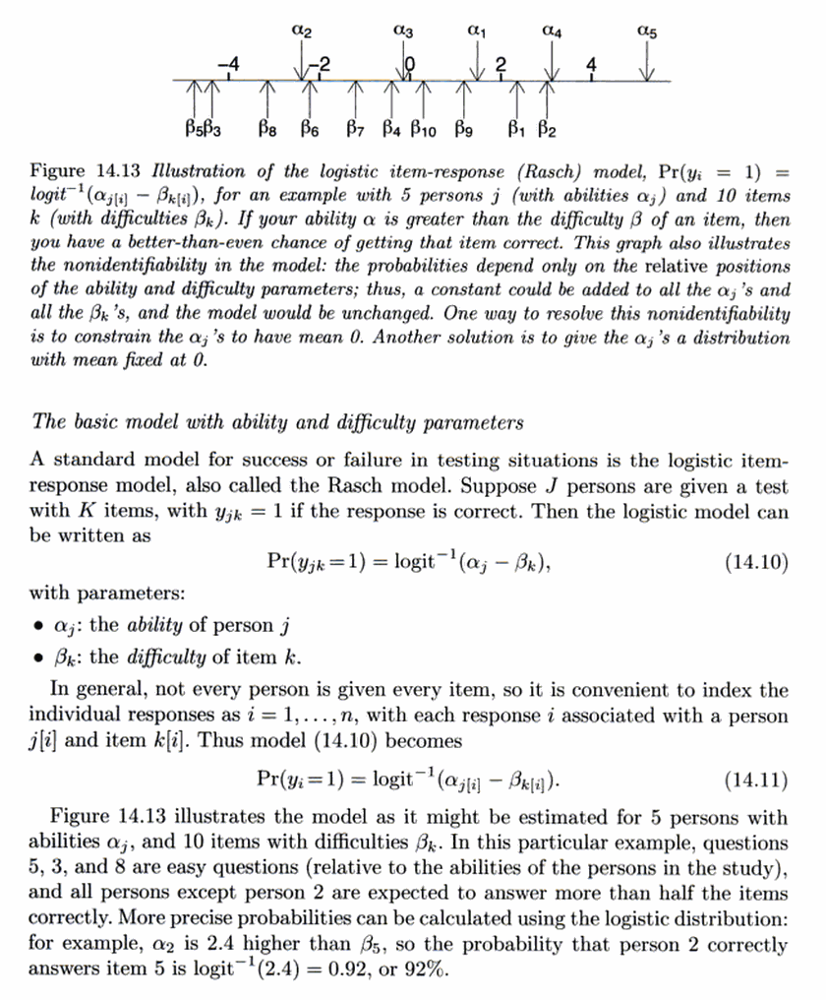

```{r setup, include = FALSE}
knitr::opts_chunk$set(
  fig.path = "figs/01-",
  echo = TRUE, 
  comment = "#>", 
  collapse = TRUE,
  fig.width = 6, 
  fig.asp = 0.62)
```

In this report, I fit a mixed effects model to perform an item-response
analysis. What I want is an estimate of each child's phonemic
discrimination ability.


Model intuition
------------------------------------------------------------------------

In a mixed effects model, we have a sample of units, each of which have
their own "effect" we want to estimate. For example, these might be
participants with multiple trials or responses in an experiment. We
could estimate each participant's effect separately, but this leaves
some information on the table. If we model 80 participants, we have a
good deal of information about how the 81st participant's data might
look. Mixed effects models estimate an average effect and the
distribution of effects around the average so that the units can borrow
information from each other.

To do an item-response analysis with mixed effects models, we include
two levels of effects: participants and items. Participants differ in
*ability*, and items differ in *difficulty*. @GelmanHill provide a
nice summary and visualization of the idea:


```{r, echo = FALSE, out.width = "50%"}

```

We capture these ability and difficulty effects in a mixed effects model
by using by-participant and by-item random intercepts. 


Plot empirical item-level effects
------------------------------------------------------------------------

Some of the trials, as defined by word pairs, are harder than others.

```{r sorted-empirical-pairs}
library(dplyr)
library(lme4)
library(ggplot2)

minpair <- readr::read_csv("./data/raw-minimal-pairs-responses.csv")

# Calculate the proportion correct in each pair so that we can sort 
# the WordPair factor using that value
minpair %>% 
  group_by(WordPair) %>% 
  mutate(PairProp = mean(Correct)) %>% 
  ungroup() %>% 
  mutate(WordPair = forcats::fct_reorder(WordPair, -PairProp)) %>% 
  ggplot() + 
    aes(x = WordPair, y = Correct) +
    stat_summary(fun.data = mean_se) + 
    coord_flip() + 
    labs(
      x = NULL,
      y = "Proportion Correct (Mean ± SE)")
```

But the pairs just reflect the words in them, and some of the words are
harder than others. But the words are nested in word-pairs with some of
the words repeated in different pairs.

```{r words-in-word-pairs, fig.width = 3, fig.height = 6, fig.asp = NA}
# Create
repeated <- c("juice", "keys", "moose", "mouse")
custom_sorted_pairs <- c(
  "goose-juice", "juice-moose", "moose-mouse", "mouse-mouth",
  "cheese-keys","keys-peas", "big-pig",  "hen-pen", "bee-key", 
  "star-store", "sick-sit", "horse-house", "sleep-sweep", 
  "car-jar", "cold-hold")

minpair %>% 
  mutate(
    group = ifelse(CorrectResponse %in% repeated, CorrectResponse, NA),
    WordPair = factor(WordPair, custom_sorted_pairs)) %>% 
  ggplot() + 
    aes(x = CorrectResponse, y = Correct, color = group) +
    stat_summary(fun.data = mean_se) + 
    coord_flip() +
    facet_grid(WordPair ~ . , scales = "free_y") +
    theme(strip.text.y = element_blank()) +
    labs(
      x = NULL,
      y = "Proportion Correct (Mean ± SE)") + 
    scale_color_discrete(na.value = "black", guide = FALSE)
```

Our item response analysis therefore includes word-level and
word-in-pair-level random intercepts to estimate the difficulty of
individual words.


Fit the model
------------------------------------------------------------------------

```{r}
m_minpair <- glmer(
  Correct ~ 1 + (1 | ResearchID) + (1 | CorrectResponse/WordPair),
  data = minpair,
  family = binomial(),
  # Use a different optimizer bc default may not converge
  control = glmerControl(optimizer = "bobyqa"))
summary(m_minpair)
```

Here are caterpillar plots of the effects and 95% intervals. The
participant plots are chunky presumably because participants could have
gotten the same scores.

```{r ranef-caterpillars, results = "hide", fig.show = "hold", out.width = "30%", fig.height = 8, fig.width = 4, fig.asp = NA}
lattice::dotplot(ranef(m_minpair, condVar = TRUE))
```

We can control for age too.

```{r}
m_minpair_age <- glmer(
  Correct ~ scale(MinPair_Age) + (1 | ResearchID) + (1 | CorrectResponse/WordPair),
  data = minpair,
  family = binomial(),
  # Use a different optimizer bc default may not converge
  control = glmerControl(optimizer = "bobyqa"))
summary(m_minpair_age)
```

And receptive vocabulary.

```{r}
m_minpair_vocab <- glmer(
  Correct ~ scale(MinPair_Age) + scale(PPVT_GSV) + 
    (1 | ResearchID) + (1 | CorrectResponse/WordPair),
  data = minpair,
  family = binomial(),
  # Use a different optimizer bc default may not converge
  control = glmerControl(optimizer = "bobyqa"))
summary(m_minpair_vocab)
```

Which makes the participant abilities a little smoother because we have
more information to differentiate participant's abilities.

```{r ranef-caterpillars-age, results = "hide", fig.show = "hold", out.width = "30%", fig.height = 8, fig.width = 4, fig.asp = NA}
p <- lattice::dotplot(
  ranef(m_minpair_age, condVar = TRUE),
  scales = list(y = list(alternating = 4)),
  sub = "age model")
print(p[["ResearchID"]])

p <- lattice::dotplot(
  ranef(m_minpair_vocab, condVar = TRUE), 
  scales = list(y = list(alternating = 4)),
  sub = "age + receptive vocab model")
print(p[["ResearchID"]])
```

Now we package these estimates up and save.

```{r}
tidy_abilities <- function(model, label, newdata = minpair) {
  # Get the abilities (average ability plus participant deviations from average)
  coefs <- coef(model)[["ResearchID"]] %>% 
    as.data.frame() %>% 
    tibble::rownames_to_column("ResearchID") %>% 
    select(ResearchID, coef = `(Intercept)`)  
  
  # Get the abilities (participant deviations)
  ranefs <- ranef(model)[["ResearchID"]] %>% 
    as.data.frame() %>% 
    tibble::rownames_to_column("ResearchID") %>% 
    select(ResearchID, ranef = `(Intercept)`)  
  
  # Get the predictions for each participant on an average item
  newdata$fitted <- predict(
    model, newdata, re.form = ~ (1 | ResearchID), allow.new.levels = TRUE) 
  fitted <- newdata %>% select(ResearchID, fitted) %>% distinct()
  
  coefs %>% 
    left_join(ranefs, by = "ResearchID") %>% 
    left_join(fitted, by = "ResearchID") %>% 
    tibble::add_column(Model = label, .before = 1)
}

# Include participant info
p_info <- minpair %>% 
  group_by(ResearchID) %>% 
  summarise(
    PPVT_GSV = unique(PPVT_GSV),
    MinPair_Age = unique(MinPair_Age),
    Correct = sum(Correct),
    Trials = n(),
    Proportion = Correct / Trials)

fits <- bind_rows(
  tidy_abilities(m_minpair, "base"),
  tidy_abilities(m_minpair_age, "base + age"),
  tidy_abilities(m_minpair_vocab, "base + age + ppvt")) %>% 
  left_join(p_info, by = "ResearchID") %>% 
  readr::write_csv("./data/minpair-abilities.csv")
```


Some confirmatory plots
------------------------------------------------------------------------

First, confirm that participants missing vocabulary scores did not get an
ability estimate from the model that controlled for vocabulary scores. 
There should be fewer rows of estimates in that model.

```{r}
count(fits, Model)
```

Now, we plot the participant's intercepts. These are the accuracy for an
average participant for an average item (fixed-effects intercept) plus
each participant's deviation from that average (by-participant random
intercept).

```{r ranef-controlled, results = "hide"}
ggplot(fits) + 
  aes(x = MinPair_Age, y = coef) + 
  geom_point() + 
  stat_smooth(method = "lm") + 
  facet_wrap("Model") + 
  labs(
    title = "Age effect on participant intercepts",
    x = "Age (months)", 
    y = "Participant average (log-odds)")

ggplot(fits) + 
  aes(x = PPVT_GSV, y = coef) + 
  geom_point(na.rm = TRUE) + 
  stat_smooth(method = "lm", na.rm = TRUE) + 
  facet_wrap("Model") + 
  labs(
    title = "Vocabulary effect on participant intercepts",
    x = "Vocabulary (PPVT4 GSV)", 
    y = "Participant average (log-odds)")
```


References
------------------------------------------------------------------------

