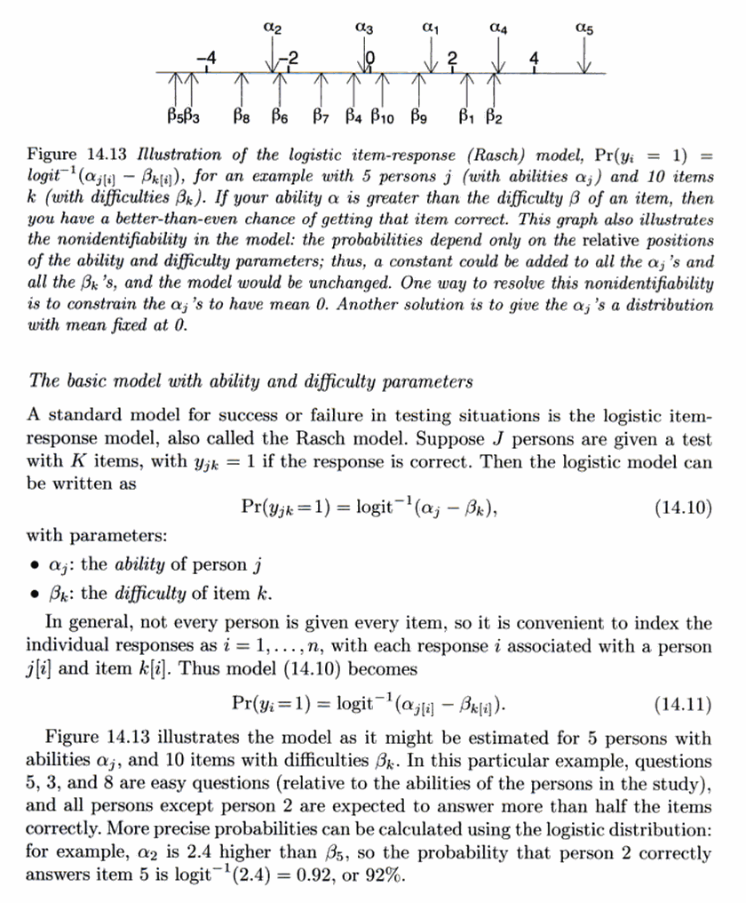
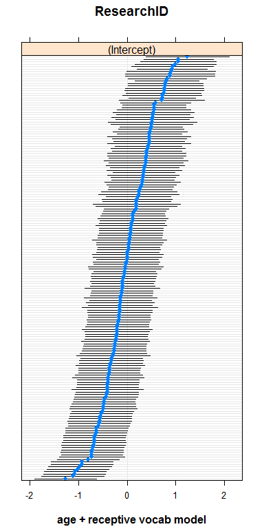

Fit the item-response model
================
Tristan Mahr
2018-03-13

In this report, I fit a mixed effects model to perform an item-response analysis. What I want is an estimate of each child's phonemic discrimination ability.

Model intuition
---------------

In a mixed effects model, we have a sample of units, each of which have their own "effect" we want to estimate. For example, these might be participants in an experiment. We could estimate each effect separately, but this leaves some information on the table. If you model 80 participants, you have a good deal of information about how the 81st participant's data might look. Mixed effects models estimate an average effect and the distribution of effects around the average so that the units can borrow information from each other.

To do an item-response analysis with mixed effects models, we include two levels of effects: participants and items. Participants differ in *ability*, and items differ in *difficulty*. Gelman and Hill (2007) provide a nice summary and visualization of the idea:



We capture these ability and difficulty effects in a mixed effects model by using by-participant and by-item random intercepts.

Plot empirical item-level effects
---------------------------------

Some of the trials, as defined by word pairs, are harder than others.

``` r
library(dplyr)
#> 
#> Attaching package: 'dplyr'
#> The following objects are masked from 'package:stats':
#> 
#>     filter, lag
#> The following objects are masked from 'package:base':
#> 
#>     intersect, setdiff, setequal, union
library(lme4)
#> Warning: package 'lme4' was built under R version 3.4.3
#> Loading required package: Matrix
library(ggplot2)

minpair <- readr::read_csv("./data/raw-minimal-pairs-responses.csv")
#> Parsed with column specification:
#> cols(
#>   .default = col_integer(),
#>   Study = col_character(),
#>   ResearchID = col_character(),
#>   MinPair_Dialect = col_character(),
#>   MinPair_EprimeFile = col_character(),
#>   Running = col_character(),
#>   Item1 = col_character(),
#>   Item2 = col_character(),
#>   ImageSide = col_character(),
#>   CorrectResponse = col_character(),
#>   WordPair = col_character()
#> )
#> See spec(...) for full column specifications.

# Calculate the proportion correct in each pair so that we can sort 
# the WordPair factor using that value
minpair %>% 
  group_by(WordPair) %>% 
  mutate(PairProp = mean(Correct)) %>% 
  ungroup() %>% 
  mutate(WordPair = forcats::fct_reorder(WordPair, -PairProp)) %>% 
  ggplot() + 
    aes(x = WordPair, y = Correct) +
    stat_summary(fun.data = mean_se) + 
    coord_flip() + 
    labs(
      x = NULL,
      y = "Proportion Correct (Mean ± SE)")
```


But the pairs just reflect the words in them, and some of the words are harder than others. But the words are nested in word-pairs with some of the words repeated in different pairs.

``` r
# Create
repeated <- c("juice", "keys", "moose", "mouse")
custom_sorted_pairs <- c(
  "goose-juice", "juice-moose", "moose-mouse", "mouse-mouth",
  "cheese-keys","keys-peas", "big-pig",  "hen-pen", "bee-key", 
  "star-store", "sick-sit", "horse-house", "sleep-sweep", 
  "car-jar", "cold-hold")

minpair %>% 
  mutate(
    group = ifelse(CorrectResponse %in% repeated, CorrectResponse, NA),
    WordPair = factor(WordPair, custom_sorted_pairs)) %>% 
  ggplot() + 
    aes(x = CorrectResponse, y = Correct, color = group) +
    stat_summary(fun.data = mean_se) + 
    coord_flip() +
    facet_grid(WordPair ~ . , scales = "free_y") +
    theme(strip.text.y = element_blank()) +
    labs(
      x = NULL,
      y = "Proportion Correct (Mean ± SE)") + 
    scale_color_discrete(na.value = "black", guide = FALSE)
```


Our item response analysis therefore includes word-level and word-in-pair-level random intercepts to estimate the difficulty of individual words.

Fit the model
-------------

``` r
m_minpair <- glmer(
  Correct ~ 1 + (1 | ResearchID) + (1 | CorrectResponse/WordPair),
  data = minpair,
  family = binomial(),
  # Use a different optimizer bc default may not converge
  control = glmerControl(optimizer = "bobyqa"))
summary(m_minpair)
#> Generalized linear mixed model fit by maximum likelihood (Laplace
#>   Approximation) [glmerMod]
#>  Family: binomial  ( logit )
#> Formula: Correct ~ 1 + (1 | ResearchID) + (1 | CorrectResponse/WordPair)
#>    Data: minpair
#> Control: glmerControl(optimizer = "bobyqa")
#> 
#>      AIC      BIC   logLik deviance df.resid 
#>   6371.1   6397.5  -3181.5   6363.1     5516 
#> 
#> Scaled residuals: 
#>     Min      1Q  Median      3Q     Max 
#> -3.9057 -0.9452  0.4417  0.6622  1.7362 
#> 
#> Random effects:
#>  Groups                   Name        Variance Std.Dev.
#>  ResearchID               (Intercept) 0.63696  0.7981  
#>  WordPair:CorrectResponse (Intercept) 0.06344  0.2519  
#>  CorrectResponse          (Intercept) 0.16723  0.4089  
#> Number of obs: 5520, groups:  
#> ResearchID, 184; WordPair:CorrectResponse, 30; CorrectResponse, 26
#> 
#> Fixed effects:
#>             Estimate Std. Error z value Pr(>|z|)    
#> (Intercept)   0.9672     0.1154   8.383   <2e-16 ***
#> ---
#> Signif. codes:  0 '***' 0.001 '**' 0.01 '*' 0.05 '.' 0.1 ' ' 1
```

Here are caterpillar plots of the effects and 95% intervals. The participant plots are chunky presumably because participants could have gotten the same scores.

``` r
lattice::dotplot(ranef(m_minpair, condVar = TRUE))
```


We can control for age too.

``` r
m_minpair_age <- glmer(
  Correct ~ scale(MinPair_Age) + (1 | ResearchID) + (1 | CorrectResponse/WordPair),
  data = minpair,
  family = binomial(),
  # Use a different optimizer bc default may not converge
  control = glmerControl(optimizer = "bobyqa"))
summary(m_minpair_age)
#> Generalized linear mixed model fit by maximum likelihood (Laplace
#>   Approximation) [glmerMod]
#>  Family: binomial  ( logit )
#> Formula: 
#> Correct ~ scale(MinPair_Age) + (1 | ResearchID) + (1 | CorrectResponse/WordPair)
#>    Data: minpair
#> Control: glmerControl(optimizer = "bobyqa")
#> 
#>      AIC      BIC   logLik deviance df.resid 
#>   6344.6   6377.7  -3167.3   6334.6     5515 
#> 
#> Scaled residuals: 
#>     Min      1Q  Median      3Q     Max 
#> -3.8884 -0.9389  0.4413  0.6587  1.7327 
#> 
#> Random effects:
#>  Groups                   Name        Variance Std.Dev.
#>  ResearchID               (Intercept) 0.51894  0.7204  
#>  WordPair:CorrectResponse (Intercept) 0.06347  0.2519  
#>  CorrectResponse          (Intercept) 0.16689  0.4085  
#> Number of obs: 5520, groups:  
#> ResearchID, 184; WordPair:CorrectResponse, 30; CorrectResponse, 26
#> 
#> Fixed effects:
#>                    Estimate Std. Error z value Pr(>|z|)    
#> (Intercept)         0.96734    0.11252   8.597  < 2e-16 ***
#> scale(MinPair_Age)  0.34411    0.06263   5.494 3.92e-08 ***
#> ---
#> Signif. codes:  0 '***' 0.001 '**' 0.01 '*' 0.05 '.' 0.1 ' ' 1
#> 
#> Correlation of Fixed Effects:
#>             (Intr)
#> scl(MnPr_A) 0.028
```

And receptive vocabulary.

``` r
m_minpair_vocab <- glmer(
  Correct ~ scale(MinPair_Age) + scale(PPVT_GSV) + 
    (1 | ResearchID) + (1 | CorrectResponse/WordPair),
  data = minpair,
  family = binomial(),
  # Use a different optimizer bc default may not converge
  control = glmerControl(optimizer = "bobyqa"))
summary(m_minpair_vocab)
#> Generalized linear mixed model fit by maximum likelihood (Laplace
#>   Approximation) [glmerMod]
#>  Family: binomial  ( logit )
#> Formula: 
#> Correct ~ scale(MinPair_Age) + scale(PPVT_GSV) + (1 | ResearchID) +  
#>     (1 | CorrectResponse/WordPair)
#>    Data: minpair
#> Control: glmerControl(optimizer = "bobyqa")
#> 
#>      AIC      BIC   logLik deviance df.resid 
#>   6021.8   6061.2  -3004.9   6009.8     5274 
#> 
#> Scaled residuals: 
#>     Min      1Q  Median      3Q     Max 
#> -4.5377 -0.9362  0.4341  0.6634  1.7471 
#> 
#> Random effects:
#>  Groups                   Name        Variance Std.Dev.
#>  ResearchID               (Intercept) 0.39328  0.6271  
#>  WordPair:CorrectResponse (Intercept) 0.07529  0.2744  
#>  CorrectResponse          (Intercept) 0.15623  0.3953  
#> Number of obs: 5280, groups:  
#> ResearchID, 176; WordPair:CorrectResponse, 30; CorrectResponse, 26
#> 
#> Fixed effects:
#>                    Estimate Std. Error z value Pr(>|z|)    
#> (Intercept)         0.97442    0.11016   8.846  < 2e-16 ***
#> scale(MinPair_Age)  0.19598    0.06262   3.130  0.00175 ** 
#> scale(PPVT_GSV)     0.39053    0.06326   6.174 6.68e-10 ***
#> ---
#> Signif. codes:  0 '***' 0.001 '**' 0.01 '*' 0.05 '.' 0.1 ' ' 1
#> 
#> Correlation of Fixed Effects:
#>             (Intr) s(MP_A
#> scl(MnPr_A)  0.005       
#> s(PPVT_GSV)  0.041 -0.355
```

Which makes the participant abilities a little smoother because we have more information to differentiate participant's abilities.

``` r
lattice::dotplot(ranef(m_minpair_age, condVar = TRUE))["ResearchID"]
lattice::dotplot(ranef(m_minpair_vocab, condVar = TRUE))["ResearchID"]
```



Now we package these estimates up and save.

``` r
tidy_abilities <- function(model, label, newdata = minpair) {
  # Get the abilities (average ability plus participant deviations from average)
  coefs <- coef(model)[["ResearchID"]] %>% 
    as.data.frame() %>% 
    tibble::rownames_to_column("ResearchID") %>% 
    select(ResearchID, coef = `(Intercept)`)  
  
  # Get the abilities (participant deviations)
  ranefs <- ranef(model)[["ResearchID"]] %>% 
    as.data.frame() %>% 
    tibble::rownames_to_column("ResearchID") %>% 
    select(ResearchID, ranef = `(Intercept)`)  
  
  # Get the predictions for each participant on an average item
  newdata$fitted <- predict(
    model, newdata, re.form = ~ (1 | ResearchID), allow.new.levels = TRUE) 
  fitted <- newdata %>% select(ResearchID, fitted) %>% distinct()
  
  coefs %>% 
    left_join(ranefs, by = "ResearchID") %>% 
    left_join(fitted, by = "ResearchID") %>% 
    tibble::add_column(model = label, .before = 1)
}

fits <- bind_rows(
  tidy_abilities(m_minpair, "base"),
  tidy_abilities(m_minpair_age, "base + age"),
  tidy_abilities(m_minpair_vocab, "base + age + ppvt")) %>% 
  readr::write_csv("./data/minpair-abilities.csv")
```

References
----------

Gelman, Andrew, and Jennifer Hill. 2007. *Data Analysis Using Regression and Multilevel/Hierarchical Models*. New York: Cambridge University Press.
